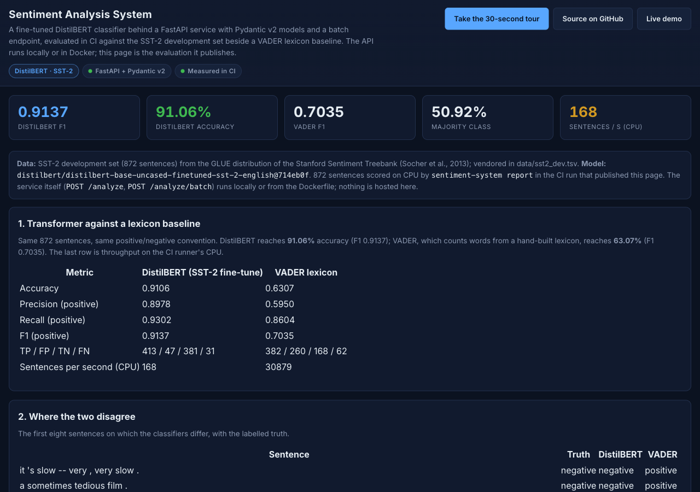
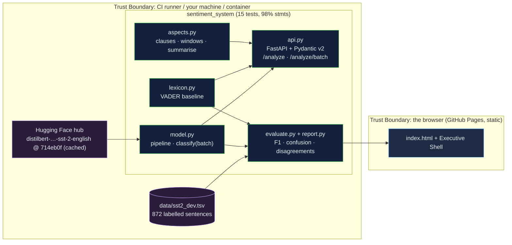

# SentimentAnalysis-System: a fine-tuned transformer behind a typed API, measured against a lexicon baseline in CI

[](https://github.com/Freddricklogan/SentimentAnalysis-System/actions/workflows/deploy.yml)
[](#5-getting-started--verification)
[](https://github.com/Freddricklogan/SentimentAnalysis-System/actions/workflows/codeql.yml)
[](LICENSE)
[](https://freddricklogan.github.io/SentimentAnalysis-System/)

## 1. Executive Summary & Business Impact

**Problem statement.** The previous version of this repository
described "deep learning models for NLP" with NLTK and spaCy. The code
counted eight positive and eight negative words and added
`random.random()` to the confidence. Emotion detection and
aspect-based analysis worked the same way (`AUDIT.md`).

**Solution & value delivered.** A sentiment service built on a
fine-tuned DistilBERT (SST-2, revision pinned) behind a FastAPI
application with Pydantic v2 request and response models: `/analyze`
for one text with a VADER comparison and aspect windows, and
`/analyze/batch` for up to 64 texts. An evaluation harness runs in CI
on the 872-sentence SST-2 development set and publishes the result:
DistilBERT F1 0.9137 and accuracy 91.06 % against VADER's 0.7035 and
63.07 %, with the confusion counts, throughput and the sentences on
which the two disagree. The API runs locally or from a Dockerfile that
bakes the model in; the published page is the evaluation.

**[→ Read the full case study](docs/CASE_STUDY.md)**



## 2. Demonstrated Competencies & Technical Skills

- **NLP & Evaluation** — pinned pretrained transformer, lexicon
  baseline, F1/precision/recall/accuracy with confusion counts on a
  standard labelled set, disagreement analysis, aspect windows cut at
  sentence and contrast boundaries.
- **API Design** — FastAPI with Pydantic v2 validation (blank, length
  and batch-size limits), dependency-injected classifier, typed
  responses, `/health` and `/model`.
- **MLOps** — model revision pinning, Hugging Face cache in CI, CPU-only
  torch via a pinned index, Dockerfile with the model baked in, report
  generated and deployed by the pipeline.
- **Engineering Practice** — 15 tests at 98 % statement coverage with
  an integration test for the real model, mypy strict, ruff, bandit,
  pip-audit, Trivy.

## 3. System Architecture & Data Flow



The Pages site holds only the evaluation report; no model runs in the
browser and no text is sent anywhere by the page.

## 4. Technical Highlights & Engineering Decisions

### ADR-1 — A pinned pretrained model, not a claimed one

**Context.** The README claimed deep learning; the code used
`random`.

**Decision.** `model.py` loads
`distilbert-base-uncased-finetuned-sst-2-english` at a pinned hub
revision through the `transformers` pipeline, lazily, on CPU, with
truncation at 512 tokens. `GET /model` reports the name.

**Consequence.** The evaluation refers to one artefact, and CI
reproduces it from the cache in seconds.

### ADR-2 — The classifier is a dependency

**Context.** Tests that download 268 MB are tests nobody runs.

**Decision.** `Classifier` is a callable type; the API takes it through
FastAPI's dependency system and `create_app(classifier=…)` accepts a
double. The unit suite uses a keyword double; one integration test
runs the real model when `SENTIMENT_INTEGRATION=1`, which CI sets with
the hub cache.

**Consequence.** The suite runs in seconds locally and still proves the
real model in CI.

### ADR-3 — Aspect windows cut at contrast boundaries

**Context.** Exercising the live API showed "the screen is gorgeous but
the battery dies by noon" scoring the screen negative because the
window crossed "but".

**Decision.** Sentences are split at contrast conjunctions and
semicolons before windows are cut; each window is scored by the same
classifier and returned in the response so the reader can see what
was judged.

**Consequence.** Clause-level results that match what a person would
say, with a test that pins the split; the method is described as
simple in the code because it is.

## 5. Getting Started & Verification

**Prerequisites.** Python 3.12 and `uv`; the first run downloads the
model (268 MB) into the Hugging Face cache.

```bash
git clone https://github.com/Freddricklogan/SentimentAnalysis-System.git
cd SentimentAnalysis-System
uv venv && uv pip install -e ".[dev]"
make check                                  # lint, typecheck, test (incl. integration), security, build
uv run sentiment-system serve               # http://127.0.0.1:8000/docs
curl -s -X POST localhost:8000/analyze -H 'content-type: application/json' \
  -d '{"text":"The screen is gorgeous but the battery dies by noon."}'
uv run sentiment-system report --out dist   # SST-2 evaluation → dist/index.html, report.json
docker build -t sentiment-system . && docker run --rm -p 8000:8000 sentiment-system
```

**Verification — the numbers this repository actually produced:**

| Check | Result |
| --- | --- |
| Tests (pytest, `SENTIMENT_INTEGRATION=1`) | **15 passed / 15** |
| Coverage | **98%** statements over `sentiment_system` (CLI excluded) |
| ruff, ruff format, mypy --strict | clean (15 files) |
| bandit, pip-audit | 0 findings; no known vulnerabilities |
| SST-2 dev (872 sentences, majority 50.92 %) — DistilBERT | accuracy **91.06 %** · precision 0.8978 · recall 0.9302 · **F1 0.9137** · TP/FP/TN/FN 413/47/381/31 · 168 sentences/s on a laptop CPU |
| SST-2 dev — VADER baseline | accuracy 63.07 % · precision 0.5950 · recall 0.8604 · F1 0.7035 |
| Live API smoke | `/health` ok; `/analyze` on a mixed review → negative 0.9988 with lexicon positive 0.63 and four aspect windows; `/analyze/batch` two texts → positive/negative; blank text → 422 |
| Report smoke (headless Chrome) | **0 console errors**; KPI strip, 2 tables, 3 tour steps; no horizontal scroll at 1280 or 400 px |

The CI run that publishes the page recomputes the SST-2 figures on the
runner; if they differ from this table, the page is current.

## 6. Live Demo & Production Showcase

**<https://freddricklogan.github.io/SentimentAnalysis-System/>** — the
evaluation report built by CI. The service is not hosted; run it with
`uv run sentiment-system serve` or the Dockerfile and open `/docs` for
the OpenAPI console.

**30-second guided walkthrough.** Press **Take the 30-second tour** on
the report: what the run was, the baseline comparison, and where the
two classifiers disagree.
